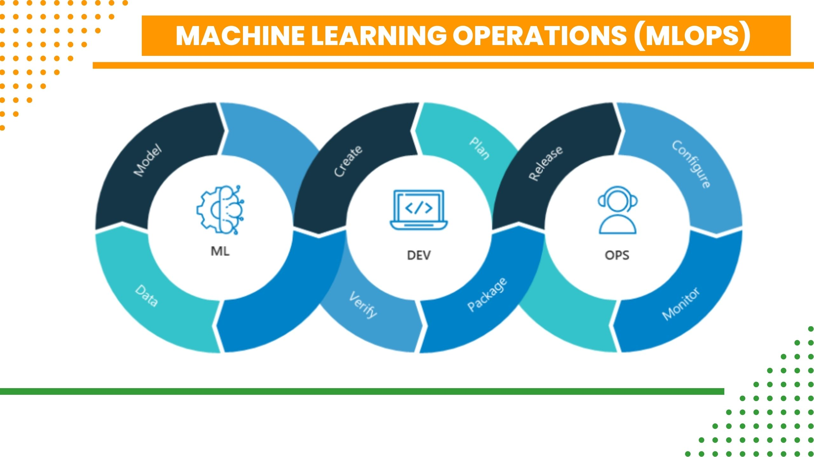

# <h1 align=center> **APLICACIÓN PARA CONSULTAR Y RECIBIR RECOMENDACIONES DE PELÍCULAS** </h1>
# <h1 align=center> **PROYECTO INDIVIDUAL Nº1** </h1>

# <h1 align=center>**`Machine Learning Operations (MLOps)`**</h1>

  

## ¡Bienvenido a nuestra aplicación para consultar y recibir recomendaciones de películas! En esta plataforma, podrás explorar y descubrir películas de acuerdo a tus preferencias y gustos personales. Nuestro sistema de recomendación utilizará técnicas de ***Machine Learning*** para brindarte sugerencias personalizadas, basadas en un historial de películas vistas. 

  

## **Descripción del proyecto**

## Contexto

En el mundo actual de las plataformas de streaming, existe una gran cantidad de contenido disponible para los usuarios. Sin embargo, puede resultar abrumador encontrar películas que se ajusten a nuestros intereses específicos. Además, muchas veces nos encontramos perdidos y no sabemos qué película ver a continuación.

Como **`Data Scientist`** Nuestro objetivo principal es desarrollar un sistema de recomendación de películas que permita a los usuarios descubrir nuevos contenidos relevantes y disfrutar de una experiencia cinematográfica personalizada.

**En este repositorio encontrarás un proceso integral de Data Science que incluye:**

🌟 Aspectos destacados

+ Un completo cuaderno de Jupyter para una visualización fluida 
+ Un proceso ETL paso a paso 
+ Análisis exploratorio de datos y generación de ideas 
+ Desarrollo de una API 
+ Modelo de aprendizaje automático para un sistema de recomendación de películas 
+ Implementación 

📚 Contenido
   

# <h1 align=center> **Desarrollo del trabajo 👷** </h1>

  

## `Transformaciones` 
El archivo **ETL.ipynb** que proporcionaste muestra una serie de pasos que realizaste para extraer, transformar y cargar datos en un DataFrame llamado 'movies'. Aquí está un resumen de los pasos que llevaste a cabo:

1. Importaste las librerías `pandas`, `numpy` y `re`.
2. Cargaste los archivos `'movies_dataset.csv'` y `'credits.csv'` en los DF`'movies'` y `'credits'`.
3. Visualizaste los registros y la forma de cada DF.
4. Normalizaste ciertas columnas en DF `'movies'` utilizando expresiones regulares y almacenaste los resultados en nuevas columnas.
5. Normalizaste las columnas `'cast'` y `'crew'` en el DF `'credits'` y almacenaste los resultados en nuevas columnas.
6. Desanidaste las columnas relevantes eliminándolas de los DF
7. Evaluaste registros nulos y duplicados en cada columna del DF `'movies'`, excluyendo la columna `'id'`.
8. Rellenaste nulos en `'revenue'` y `'budget'` con 0 en el DF `'movies'`.
9. Eliminaste 'release_date'` del DF`'movies'`, cambiaste el formato de fecha y creaste una nueva columna `'release_year'`.
10. Rellenaste nulos en `'revenue'` con 0 y eliminaste filas inválidas en `'budget'` en el DF `'movies'`.
11. Convirtió `'budget'` y `'revenue'` a tipo de datos `'float64'` en el DF `'movies'`.
12. Calculaste el retorno de inversión  `'revenue'` entre `'budget'`, asignando 0 si `'budget'` es 0 en la columna `'return'`.
13. Se evaluan registros nulos y duplicamos en cada columna del DF `'movies'`.
# </h1>

 

  

## `Desarrollo API`: 

## API en desarrollo: 6 funciones API con FastAPI

Esta API en desarrollo ofrece 6 funciones para consultar datos de películas utilizando FastAPI.

### Funciones de la API

1. `cantidad_filmaciones_mes(Mes)`: Esta función recibe como entrada un mes en español y devuelve el número de películas lanzadas durante ese mes en el conjunto de datos.

2. `cantidad_filmaciones_dia(Dia)`: Esta función recibe como entrada un día de la semana en español y devuelve el número de películas lanzadas durante ese día en el conjunto de datos.

3. `score_titulo(titulo_de_la_filmación)`: Esta función recibe como entrada el título de una película y devuelve el título, el año de lanzamiento y la puntuación de la película.

4. `votos_titulo(titulo_de_la_filmación)`: Esta función recibe como entrada el título de una película y devuelve el título, el número de votos y el promedio de los votos.

5. `get_actor(nombre_actor)`: Esta función recibe como entrada el nombre de un actor y devuelve su éxito medido a través del rendimiento. También muestra el número de películas en las que ha participado y el rendimiento promedio.

6. `get_director(nombre_director)`: Esta función recibe como entrada el nombre de un director y mide su éxito a través de los retornos de rendimiento. Además, devuelve el nombre de cada película con la fecha de lanzamiento, el rendimiento individual, el costo y el beneficio.

### Uso de la API

Puedes utilizar herramientas con URL o para hacer consultas a la API. A continuación, se muestra un ejemplo de cómo hacer una consulta utilizando URL:

http://localhost:10000/cantidad_filmaciones_mes/enero  
**o tambie puedes realizarlo de esta manera** 
http://127.0.0.1:8000/docs#/
  
# </h1>

 

  

## `EDA (Análisis de datos exploratorios)`:

1. Relación entre Budget y Revenue: Gráfico de dispersión.
2. Análisis de outliers: Boxplot de 'popularity'.
3. Nube de palabras: Generada a partir de la columna 'title'.
4. Limpieza de datos: Eliminación de columnas, completado de valores faltantes y reemplazo de valores específicos.
5. Análisis de la columna 'status': Histograma y filtrado de registros.
6. Análisis de la columna de calificación: Histograma y cálculo estadístico.
7. Análisis de la columna 'runtime': Histograma y filtrado de registros.

Estos análisis proporcionan información sobre la relación entre el presupuesto y los ingresos, identifican valores atípicos, visualizan palabras frecuentes, y analizan variables como el idioma, estado, calificación y duración de las películas.
# </h1>

  

## `Sistema de Recomendación de Películas`:  

Función de recomendación de películas: Modelo implementado para sugerir películas similares.
- recomendacion ( *`titulo`*  )  ingresa el nombre de una película y recomienda otras similares en una lista de 5 valores.

# <h1 align=center> **Mas detalles del Proyecto 👷** </h1>

## Detalles adicionales del proyecto

Aquí encontrarás información adicional y recursos relacionados con nuestro proyecto:

1. `Video explicativo:` Hemos creado un [video explicativo](link_al_video)  Te invitamos a verlo para comprender mejor cómo funciona nuestro sistema de recomendación de películas.

 

2. `Acceso a la API:` Proporcionamos documentación completa sobre cómo acceder a nuestra [API de recomendación de películas](https://douglasanchez.onrender.com/). Esta API te permitirá obtener recomendaciones personalizadas y utilizarlas en tu propia aplicación o proyecto.

3. `Obtención de datos originales:` Si estás interesado en obtener acceso a los datos originales utilizados en nuestro análisis, ofrecemos un [enlace de descarga](https://drive.google.com/drive/folders/12aVGMdfpX0FbhbAGYT3ixhsm58n5w8ts?usp=sharing) para que puedas explorar y analizar los datos por ti mismo.

4. `Acceso rápido:`
- Visualize ETL  [`ETL.ipynb`](./ETL.ipynb) notebook.
- Visualize EDA  [`EDA.ipynb`](./EDA.ipynb) notebook.
- Visualize API  [`MAIN.PY`](./main.py)

No dudes en explorar estos recursos para obtener una visión más completa y detallada de mi proyecto de recomendación de películas. Si tienes alguna pregunta o necesitas más información, no dudes en contactarnos [Sanchezdouglas](@Sanchezdouglas). ¡Disfruta del proyecto!

